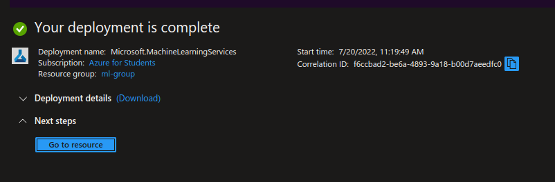
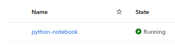

# Creating a our first program with Microsoft Azure Portal and Azure Machine Learning Studio

---------------------------------------------------------

## Requirements
- Microsoft Azure Account ( with funds or credits )
- Microsoft Azure Suscription
- A web browser
- Access to internet

---------------------------------------------------------

## Instructions
#### 1. Login to the [Azure Portal](https://portal.azure.com/).
#### 2. Once you're on the portal's home page, you will see something like this:

#### 3. Inside the search bar (located at the top), look for *azure machine learning* and click on it.

#### 4. Click on *Create*.

#### 5. First, configure the resource details: select your subscription and add it to a resource group. In my case, I am creating a new resource group.

#### 6. Now you'll need to configure the workspace details, you will need to give a workspace name,select and select a region. In order to use this service you will also need a storage account, a key vault, appligation insights and a container registry (optional); by default, this resources will be created with a similar name to the workspace's name, but you can change it if you want.

#### 7. Click on *Review + create*.

#### 8. If validation passed, click on *Create*.

#### 9. Deployment will begin. Please wait a couple of seconds for it to complete.

#### 10. Once deployment is complete, click *Go to resource*.

#### 11. Go to [Azure Machine Learning Studio](https://ml.azure.com/home) and login with your Microsoft Account.
#### 12. Look for the workspace you just created and click *Go to workspace*.

#### 13. On the right left side of the page, you will see a bunch of icons in line. Click on the one with the computer icon to get to the *Compute* section.

#### 14. Click on *New*.

#### 15. You will now be creating a VM instance to work on it. Give it a name and choose the lighter configuration possible; we will just be using it for a "Hello World", there's no need to give it a lot of processing power.

#### 16. When you're done configuring it, click on *Create*.

#### 17. Wait or your VM to create.

#### 18. When you see the state of your VM as running, that means it's ready.

#### 19. On the left bar, clcik on the notebook icon to get to the *Notebook* section.

#### 20. Click on *Create*.

#### 21. Click on the '+' button and then *Create new file*.

#### 22. Inside the white rectangle that appears on the main page, change your notebook's name if you want and then click *Create*.

#### 23. You will now be inside a Python Notebook. In order to print a "Hello World" inside the console just type:
> print("Hello world)

#### 24. Run your code by tapping on the "run code" button on the left side of it.

#### Extra: you can also edit your code inside VS Code by click on the Edit in VS Code button; this will open the application on your program and, once you install a couple of extensions and login to your Microsoft account, you're ready to go.

---------------------------------------------------------

## Congratulations ! You've just made your first program in Azure Machine Learning Studio !
Don't forget to delete all of your resources! If you don't, it will be very expensive.
